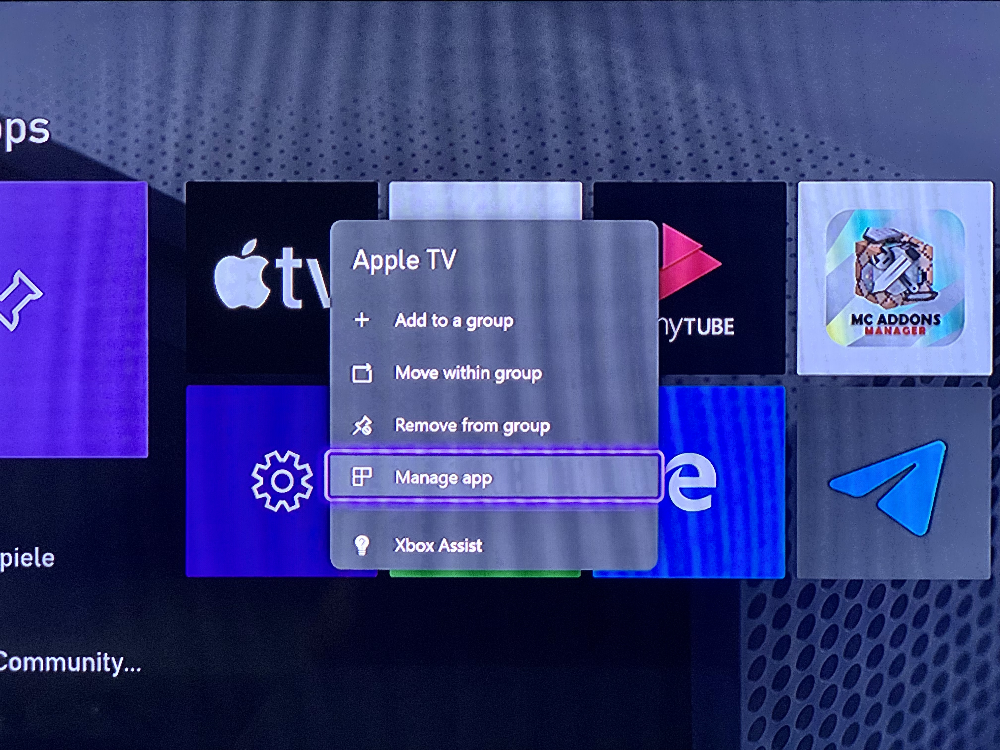
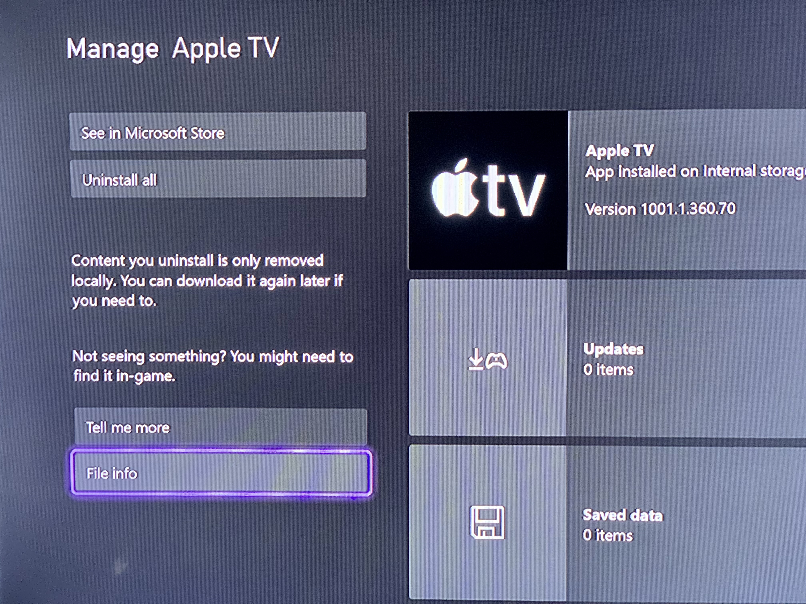

# app-list-for-homebridge-smartglass

This list is meant to be a simple copy and paste solution for the [homebridge-smartglass](https://github.com/unknownskl/homebridge-smartglass) plugin. As [Microsoft ended support for Smartglass](https://twitter.com/majornelson/status/998790240377565184) the Title ID in listTable.txt is just a nice to have but apps won't be launchable anymore.

## You can help expanding the list

On your Xbox it is pretty easy.

1st navigate to the app or game you want to add 
2nd use the menu button and select "Manage app" 

3rd select "File info" in the lower left of the screen 

4th extracth the information. Preferrably add it to the lists as a pull request but an issue with a screenshot will work, too. 

