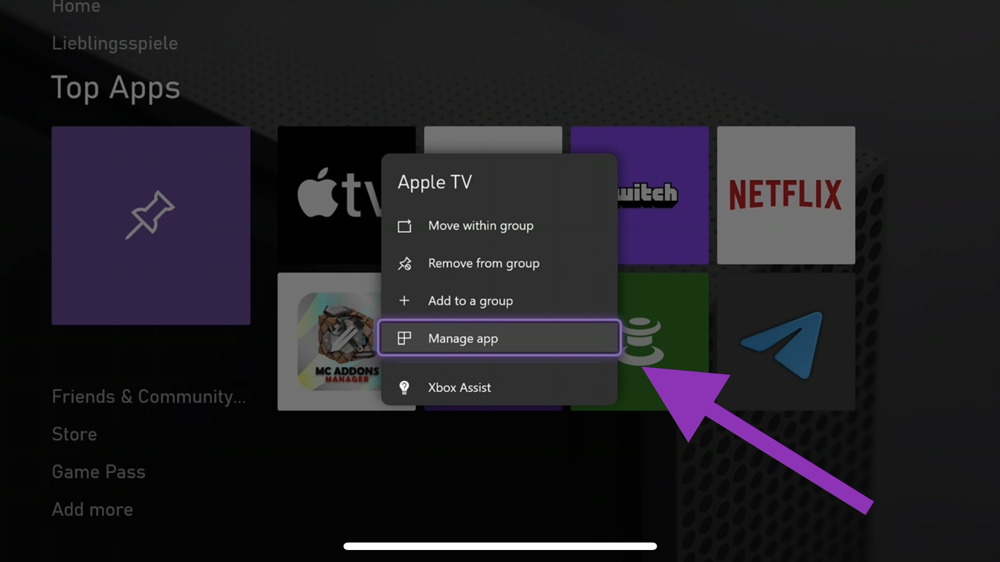
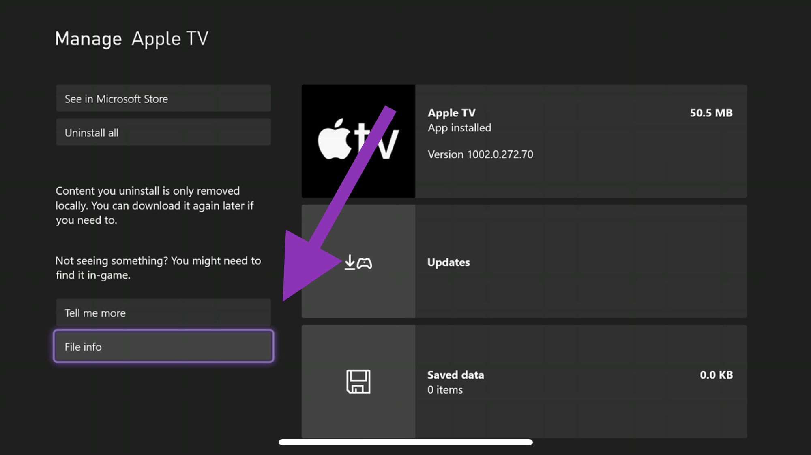
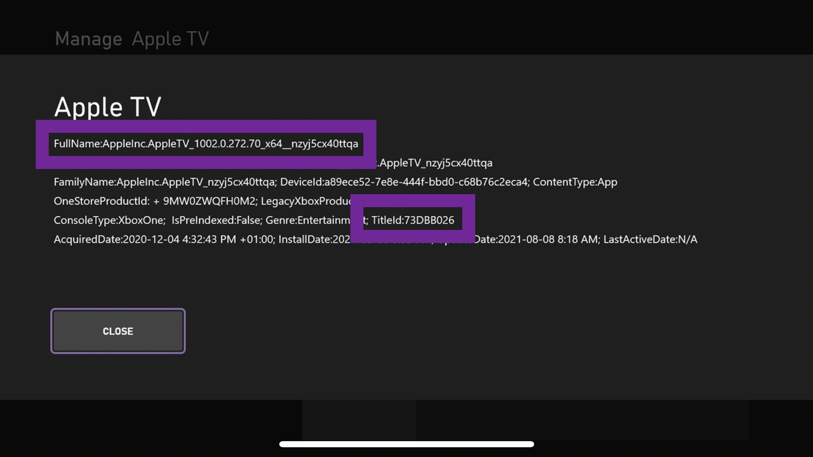

# app-list-for-homebridge-smartglass

This repo aims to help configuring the [homebridge-smartglass](https://github.com/unknownskl/homebridge-smartglass) plugin. As [Microsoft ended support for Smartglass](https://twitter.com/majornelson/status/998790240377565184) the Title ID in listTable.txt is just a nice to have but apps won't be launchable anymore.

## Things to note
The TitleID seems to be unique for every installation, below you can see how to get it.

## You can help expanding the list

If you have set up [homebridge-smartglass](https://github.com/unknownskl/homebridge-smartglass) or [homebridge-xbox-tv](https://github.com/grzegorz914/homebridge-xbox-tv), you can get the information for launched software right from your Homebridge logs. 
To access those informations on your XBox, do the following: 

1st Navigate to the app or game you want to add. 
2nd Use the menu button and select "Manage app" 

3rd select "File info" in the lower left of the screen 

4th The marked areas are the code strips you need to set up the plugins. 

